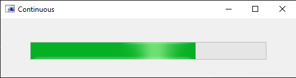
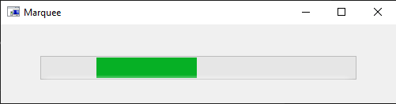

# Version information

Version information for the [VBScripting](https://github.com/koswald/VBScript "github.com") project.

- [Version 1.4.11 (the latest version)](#version-1411)  
- [Version 1.4.10](#version-1410)  
- [Version 1.4.9](#version-149)  
- [Version 1.4.8](#version-148)  
- [Version 1.4.7](#version-147)  
- [Version 1.4.6](#version-146)  
- [Version 1.4.5](#version-145)  
- [Version 1.4.4](#version-144)  
- [Version 1.4.3](#version-143)  
- [Version 1.4.2](#version-142)  
- [Version 1.4.1](#version-141)  
- [Version 1.4.0](#version-140)  

# Version 1.4.11

Modified [CopyToProgramFiles.vbs](./CopyToProgramFiles.vbs):

- Does not require Setup.vbs to have been run.
- Creates the target folder if necessary.
- Improved error handling.

Modified the [TestingFramework](./class/TestingFramework.vbs) class:

- Added the OnFailString property, an optional string written the console when a spec fails, intended to show likely causes for the failure. The OnFailString property is used in the Configurer class [integration test](spec\Configurer.spec.wsf).

Refactored [RegistryClasses.vbs](./examples/src/RegistryClasses.vbs).

# Version 1.4.10

Links referencing docs.microsoft.com were updated to point to learn.microsoft.com.  

Improved error handling for IconExtractor.hta.  

Added Null check for battery charge to BatteryStatus.hta.  

Minor changes to PresentationSettings.hta: added onhover/title text to show in advance what commands are executed for selected buttons.  

Improved code comments for the TestingFramework class.  

# Version 1.4.9

Added `user-content-` to more links in .md files that link to headers in other .md files: [./.Net/build/ReadMe.md](./.Net/build/ReadMe.md), [./class/wsc/ReadMe.md](./class/wsc/ReadMe.md), [./docs/algorithm/ReadMe.md](./docs/algorithm/ReadMe.md), [./docs/img/ReadMe.md](./docs/img/ReadMe.md), [./examples/Presentation.md](./examples/Presentation.md), and [./spec/bug/PopUp-bug.md](./spec/bug/PopUp-bug.md). See [version 1.4.7](#version-147) comments.  

# Version 1.4.8

Changes to documentation: Fixed a couple of broken links.  

# Version 1.4.7

Workaround for broken links in ChangeLog.md (this file) and ReadMe.md that link to a header in another .md file. This involves adding the prefix `user-content-` to the header/hash portion of the link. 

For example,

``` markdown
[link](https://github.com/koswald/VBScript/blob/master/ReadMe.md#installation)
```
becomes

``` markdown
[link](https://github.com/koswald/VBScript/blob/master/ReadMe.md#user-content-installation)
```

For discussions of the rationale for GitHub adding the prefixes, see links at https://github.com/Flet/markdown-it-github-headings#user-content-why-should-i-prefix-heading-ids.  

# Version 1.4.6

- Fixed a broken link in docs/ReadMe.md.  

- <del> Fixed</del> <ins>Modified</ins> several broken links in the project ReadMe.md and in this ChangeLog.md linking to headers in separate .md files <del> that required the full path to be hardcoded</del>. The attempted fix involved including the full path but this did not have the desired effect: The browser navigates to the correct .md file, but does not scroll to the desired anchor/header until F5 is pressed. See [Version 1.4.7](#version-147) for the actual fix/workaround.  

- Made improvements to code comments and documentation.  

- Minor changes to code with no runtime effect.

# Version 1.4.5

- Updated ProgressBar.cs to show the familiar "glow" animation and also the marquee style.  

  These styles are selected by using the new [Style property](https://github.com/koswald/VBScript/blob/master/docs/CSharpClasses.md#user-content-progressbar) of the VBScripting.ProgressBar object. The relevant changes to [ProgressBar.cs](./.Net/ProgressBar.cs) were the addition of the Style property and calling the EnableVisualStyles method of the Application class in the constructor. For a demo, run [ProgressBar-test.vbs](./.Net/test/ProgressBar-test.vbs) or [IconExtractor.hta](./examples/IconExtractor.hta).

  

  

- With selected .hta and .wsf files in the `examples` folder, VBScript code was moved to separate files in the `src` folder, for more appropriate syntax highlighting in github.com.

- Changes to code comments, code styling, and documentation.  

# Version 1.4.4

- Modified [CopyToProgramFiles.vbs](CopyToProgramFiles.vbs) and [FolderSender.vbs](class/FolderSender.vbs) so that they work properly together even before Setup.vbs is run, which was supposed to have been a feature of CopyToProgramFiles.vbs as stated in the [ReadMe](https://github.com/koswald/VBScript/blob/master/ReadMe.md#user-content-install).  

- See [Issues with v1.4.2](#issues-with-v142).  

# Version 1.4.3

- Fixed typo in ChangeLog.md (this file).  
- Disabled PopUp messages in [StringFormatter.wsc](class/wsc/StringFormatter.wsc).  

- See [Issues with v1.4.2](#issues-with-v142).  

# Version 1.4.2

- [PushPrep.hta updated](#pushprephta-updated)  
- [ShellSpecialfolders class added](#shellspecialfolders-class-added)  
- [Issues with v1.4.2](#issues-with-v142)  
- [Issues fixed with v1.4.2](#issues-fixed-with-v142)  

## PushPrep.hta updated

Moved the main script to a separate file for improved VBScript syntax highlighting in github.com.

## ShellSpecialFolders class added

Added a new class ShellSpecialFolders ( [code](class/ShellSpecialFolders.vbs) | [docs](https://github.com/koswald/VBScript/blob/master/docs/VBScriptClasses.md#user-content-shellspecialfolders) | [spec](spec/ShellSpecialFolders.spec.vbs) ).  

## Issues with v1.4.2

- [Incomplete Setup exit with PushPrep.hta](#incomplete-setup-exit-with-pushprephta)  

- See [general project issues](https://github.com/koswald/VBScript/blob/master/ReadMe.md#user-content-issues).  

### Incomplete Setup exit with PushPrep.hta

**Bug description:** If Setup.vbs is started from PushPrep.hta and then cancelled from the User Account Control dialog, when elevation of privileges is requested, then Setup.bat must be manually deleted before PushPrep.hta continues. This is a pre-existing issue.  

**Mitigating factors:** Edge case. Similar behavior is not seen and not applicable when Setup.vbs is started another way.

## Issues fixed with v1.4.2

- [No file extension error](#no-file-extension-error)  
- [Error running FolderSender.spec.wsf from %ProgramFiles%](#error-running-foldersenderspecwsf-from-programfiles)  

### No file extension error

**Bug description:** In recent versions, individual integration tests and test suites may fail with the error message, "Input Error: There is no file extension in...&#60;path&#62;", where &#60;path&#62; is the left part of the test or test suite filespec, up to the first space. All of the following conditions must be present in order to duplicate the error:  

- The project version is v1.4.0 or v1.4.1.
- The project path includes a space, as when the project is installed in C:\Program Files\VBScripting.  
- A script/hta restart method is being called, either the RestartWith method of the VBSHoster class or the RestartUsing method of the VBSApp class, as when the TestingFramework class is instantiated but cscript.exe is not the host.  
- The restart method is configured to use PowerShell or Windows PowerShell as the shell.  
- The restart method is called and configured so that a script/hta restart will be attempted. That is, the current state must be different from the desired state with respect to either 1) privileges, whether they are elevated, or 2) the scripting host, whether cscript.exe or wscript.exe or mshta.exe is hosting the script.  

**Resolution:** This issue was fixed by surrounding the script filespec with single quotes in the powershell command--this is in addition to the double quotes that were already in use. Regression tests were incorporated into VBSHoster.spec.wsf and VBSApp.spec.vbs. 

### Error running FolderSender.spec.wsf from %ProgramFiles%

**Bug description:** With the project located in %ProgramFiles%\VBScripting, the integration test FolderSender.spec.wsf may request that privileges be elevated, which is typically not necessary or appropriate for this test. Only certain tests are intended to be run with elevated privileges, and FolderSender.spec.wsf is not one of them.

**Resolution:** FolderSender.spec.wsf now makes use of the %AppData% folder, where elevated privileges are not required for creating files and folders.

# Version 1.4.1

- [WMIUtility class links added](#wmiutility-class-links-added)  
- [ReadMe links added, corrected](#readme-links-added-corrected)  
- [RegisterWsc.wsf updated](#registerwscwsf-updated)  

## WMIUtility class links added

Improved the [code comments](class/WMIUtility.vbs) and the [docs](https://github.com/koswald/VBScript/blob/master/docs/VBScriptClasses.md#user-content-wmiutility) for the WMIUtiltiy class: added links to specific [Computer System Hardware Classes](https://learn.microsoft.com/en-us/windows/win32/cimwin32prov/computer-system-hardware-classes).  

## ReadMe links added, corrected

- Added [reference links](https://github.com/koswald/VBScript/blob/master/ReadMe.md#user-content-references) to ReadMe.md.  

- Corrected [link](https://github.com/koswald/VBScript/blob/master/ReadMe.md#user-content-installation) to [CopyToProgramFiles.vbs](./CopyToProgramFiles.vbs) (formerly CopyToProgramFiles.wsf).  

## RegisterWsc.wsf updated

Corrected comment syntax in [RegisterWsc.wsf](examples/RegisterWsc.wsf), which had no runtime effect.

# Version 1.4.0

- [Configurer class added](#configurer-class-added) - New  
- [CommandParser class breaking change](#commandparser-class-breaking-change)  
- [FolderSender class added](#foldersender-class-added) - New  
- [CopyToProgramFiles.vbs updated](#copytoprogramfilesvbs-updated)
- [StartupItems class moved](#startupitems-class-moved)  
- [ArrayOfObjects class added](#arrayofobjects-class-added)  
- [Error numbers updated](#error-numbers-updated)  
- [LoadObject method added](#loadobject-method-added)  
- [Numerous files refactored](#numerous-files-refactored)  
- [Change log added](#change-log-added)  

## Configurer class added

An improved configuration scheme was implemented with the Configurer class ( [code](class/Configurer.vbs) | [doc](https://github.com/koswald/VBScript/blob/master/docs/VBScriptClasses.md#user-content-configurer) ), using files with the `configure` filename extension. The old scheme uses the `config` filename extension and is still functional.  

The Configurer class uses comma-delimited key/value pairs in the `.configure` files, which are created manually.  Configuration files can be associated with class files, script files, the entire project, or a particular user. Configuration files associated with a class or script or hta take the same base name of the file with which they are associated, and reside in the same folder.

## CommandParser class breaking change

The CommandParser class ( [code](class/CommandParser.vbs) | [doc](https://github.com/koswald/VBScript/blob/master/docs/VBScriptClasses.md#user-content-commandparser) ) has been completely reworked for simplicity and testability. This is a breaking change. None of the previous pubic members still work, but the overall functionality is similar.

## FolderSender class added

A FolderSender class ( [code](class/FolderSender.vbs) | [doc](https://github.com/koswald/VBScript/blob/master/docs/VBScriptClasses.md#user-content-foldersender) ) was added, leveraging a rich and familiar Windows-native graphical interface, thanks to the <code> Shell.Application</code> object's CopyHere and MoveHere methods. The class was formerly located in CopyToProgramFiles.vbs and was named FolderCopier.

## CopyToProgramFiles.vbs updated

The target folder in [CopyToProgramFiles.vbs](CopyToProgramFiles.vbs) was changed from %ProgramFiles%&#92;KOswald to %ProgramFiles%&#92;VBScripting and the FolderCopier class was renamed to FolderSender and moved to the `class` folder. See [FolderSender class added](#foldersender-class-added).

## StartupItems class moved

The StartupItems class ( [code](class/StartupItems.vbs) | [doc](https://github.com/koswald/VBScript/blob/master/docs/VBScriptClasses.md#user-content-startupitems) ) was moved out of StartItems.hta ( [code](examples/StartItems.hta) ) and into the class folder.

## ArrayOfObjects class added

The ArrayOfObjects class  ( [code](class/ArrayOfObjects.vbs) | [doc](https://github.com/koswald/VBScript/blob/master/docs/VBScriptClasses.md#user-content-arrayofobjects) ) was moved out of StartItems.hta ( [code](examples/StartItems.hta) ) and into the class folder.

## LoadObject method added

An experimental method LoadObject has been added to the [VBScripting.Includer](https://github.com/koswald/VBScript/blob/master/docs/VBScriptClasses.md#user-content-includer) object. LoadObject doesn't work with all project classes and it doesn't work within a class block. LoadObject is the default member of its class.  

## Error numbers updated

`Err.Raise` statement error numbers have been updated to conform to published error codes.

For example, this statement

```vb
Err.Raise 1,, "Command-line argument required: a filespec for the file to open."
```

becomes

```vb
Err.Raise 449,, "Command-line argument required: a filespec for the file to open."
```

The second statement above typically will cause a modal message with the code `800A01C1`. Hexadecimal 1C1 can be converted to decimal 449, and then the generic run-time error description can be looked up [online](https://learn.microsoft.com/en-us/previous-versions/windows/internet-explorer/ie-developer/scripting-articles/5ta518cw(v=vs.84)) or in the following table.

| Dec | Hex | Err.Description                           |  
| --: | --: | ------------------------------------- |  
|   5 |   5 | Invalid prodedure call or argument    |  
|  13 |   D | Type mismatch                         |  
|  17 |  11 | Can't perform the requested operation |  
|  51 |  33 | Internal error                        |  
|  70 |  46 | Permission denied                     |  
| 449 | 1C1 | Argument not optional                 |  
| 450 | 1C2 | Wrong number of arguments or invalid property assignment |  
| 500 | 1F4 | Variable undefined                    |  
| 505 | 1F9 | Invalid or unqualified reference      |  
| 507 | 1FB | An exception occurred                 |  

## Numerous files refactored

Many files were refactored:

- Variable declarations were moved closer to the top of the file.  

- In class blocks, Sub Class_Initialize blocks were moved closer to the top of the file, in part to more quickly assess dependencies.  

- The CommandParser class was refactored. See [above](#commandparser-class).  

- Many line-ending spaces were removed in multiple files. Double-spaces at the end of lines in lists in `.md` files--this line for example--were intentionally retained.  

## Change log added

The change log (this file) was added.
